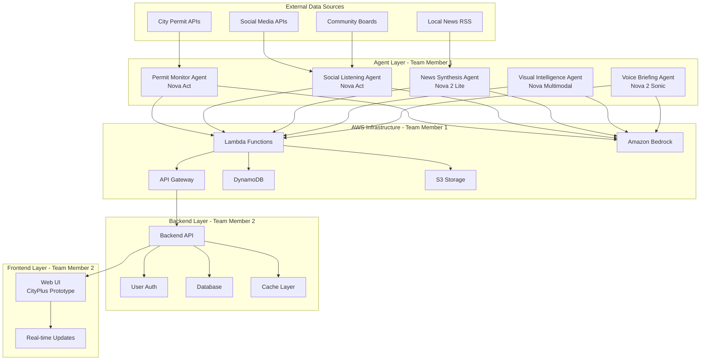

# Design Document: CityPulse Project Workflow

## Overview

CityPulse is a hyperlocal community intelligence platform built with a multi-agent AI architecture. The project is divided between two developers: Team Member 1 handles AWS infrastructure and AI agents, while Team Member 2 handles backend API and frontend development. This design establishes the architecture, folder structure, integration contracts, and development workflow to enable parallel development with clear handoff points.

## Architecture

### High-Level System Architecture




### Team Responsibilities Breakdown

**Team Member 1 (You - AI/Agent Handler):**
- Set up AWS account and configure Amazon Bedrock access
- Implement 5 AI agents using Amazon Nova models
- Create Lambda functions for each agent
- Configure API Gateway to expose agent endpoints
- Set up DynamoDB tables for agent data storage
- Configure S3 buckets for image/file storage
- Provide API documentation and integration examples

**Team Member 2 (Teammate - Backend/Frontend):**
- Build backend API that calls agent endpoints
- Implement user authentication and authorization
- Create database schemas for user data
- Enhance existing frontend prototype with agent features
- Implement real-time notification system
- Build UI components for displaying insights

## Components and Interfaces

### Project Folder Structure

```
citypulse/
├── agents/                          # Team Member 1 works here
│   ├── permit-monitor/
│   │   ├── handler.py              # Lambda function
│   │   ├── scraper.py              # Data collection logic
│   │   ├── requirements.txt
│   │   └── tests/
│   ├── social-listening/
│   │   ├── handler.py
│   │   ├── analyzer.py
│   │   ├── requirements.txt
│   │   └── tests/
│   ├── news-synthesis/
│   │   ├── handler.py
│   │   ├── aggregator.py
│   │   ├── requirements.txt
│   │   └── tests/
│   ├── visual-intelligence/
│   │   ├── handler.py
│   │   ├── image_processor.py
│   │   ├── requirements.txt
│   │   └── tests/
│   ├── voice-briefing/
│   │   ├── handler.py
│   │   ├── briefing_generator.py
│   │   ├── requirements.txt
│   │   └── tests/
│   ├── shared/
│   │   ├── bedrock_client.py       # Shared Bedrock utilities
│   │   ├── data_schemas.py         # Common data models
│   │   └── config.py               # Configuration
│   └── infrastructure/
│       ├── terraform/               # Infrastructure as Code
│       ├── cloudformation/          # Alternative IaC
│       └── deploy.sh                # Deployment scripts
├── backend/                         # Team Member 2 works here
│   ├── src/
│   │   ├── routes/
│   │   ├── controllers/
│   │   ├── models/
│   │   └── services/
│   ├── tests/
│   └── package.json
├── frontend/                        # Team Member 2 works here
│   └── CityPlus-prototype/         # Existing prototype
│       ├── index.html
│       ├── main.html
│       ├── styles.css
│       └── ...
├── docs/                            # Shared documentation
│   ├── api-contracts/
│   │   ├── agent-apis.yaml         # OpenAPI spec for agents
│   │   └── backend-apis.yaml       # OpenAPI spec for backend
│   ├── architecture/
│   │   └── diagrams/
│   └── integration-guide.md
├── shared/                          # Shared code/configs
│   ├── schemas/
│   │   ├── permit.json
│   │   ├── social-post.json
│   │   ├── news-article.json
│   │   └── briefing.json
│   └── config/
│       ├── .env.example
│       └── api-endpoints.json
└── README.md
```


### Agent API Interfaces

Each agent exposes a REST API through AWS API Gateway. All endpoints follow this pattern:

**Base URL:** `https://api.citypulse.com/v1/agents/`

#### 1. Permit Monitor Agent API

**Endpoint:** `GET /permits`

**Request Parameters:**
```json
{
  "latitude": 37.7749,
  "longitude": -122.4194,
  "radius_miles": 1.0,
  "start_date": "2024-01-01",
  "end_date": "2024-12-31",
  "permit_types": ["building", "liquor", "zoning"]
}
```

**Response Schema:**
```json
{
  "status": "success",
  "data": {
    "permits": [
      {
        "id": "permit-12345",
        "type": "building",
        "address": "123 Main St",
        "description": "New restaurant construction",
        "filed_date": "2024-02-15",
        "status": "approved",
        "coordinates": {
          "lat": 37.7749,
          "lng": -122.4194
        },
        "distance_miles": 0.3
      }
    ],
    "total_count": 15,
    "timestamp": "2024-02-26T10:30:00Z"
  }
}
```

#### 2. Social Listening Agent API

**Endpoint:** `GET /social`

**Request Parameters:**
```json
{
  "latitude": 37.7749,
  "longitude": -122.4194,
  "radius_miles": 2.0,
  "keywords": ["traffic", "construction", "event"],
  "sources": ["facebook", "reddit", "nextdoor"],
  "limit": 50
}
```

**Response Schema:**
```json
{
  "status": "success",
  "data": {
    "posts": [
      {
        "id": "post-67890",
        "source": "reddit",
        "author": "user123",
        "content": "Major traffic on Main St due to construction",
        "sentiment": "negative",
        "topics": ["traffic", "construction"],
        "posted_at": "2024-02-26T08:15:00Z",
        "engagement": {
          "likes": 45,
          "comments": 12
        }
      }
    ],
    "trending_topics": ["construction", "new_restaurant", "parking"],
    "sentiment_summary": {
      "positive": 0.3,
      "neutral": 0.5,
      "negative": 0.2
    }
  }
}
```


#### 3. News Synthesis Agent API

**Endpoint:** `GET /news`

**Request Parameters:**
```json
{
  "location": "San Francisco, CA",
  "categories": ["local", "business", "safety"],
  "days_back": 7
}
```

**Response Schema:**
```json
{
  "status": "success",
  "data": {
    "articles": [
      {
        "id": "news-11111",
        "title": "New Tech Hub Opening Downtown",
        "summary": "AI-generated summary of the article...",
        "source": "SF Chronicle",
        "published_at": "2024-02-25T14:00:00Z",
        "url": "https://...",
        "relevance_score": 0.92,
        "category": "business"
      }
    ],
    "trends": [
      {
        "topic": "tech_development",
        "article_count": 8,
        "trend_direction": "increasing"
      }
    ]
  }
}
```

#### 4. Visual Intelligence Agent API

**Endpoint:** `POST /visual/analyze`

**Request Body:**
```json
{
  "image_url": "https://s3.amazonaws.com/citypulse/images/photo123.jpg",
  "analysis_types": ["object_detection", "text_extraction", "scene_classification"]
}
```

**Response Schema:**
```json
{
  "status": "success",
  "data": {
    "objects_detected": [
      {
        "label": "construction_equipment",
        "confidence": 0.95,
        "bounding_box": {"x": 100, "y": 150, "width": 200, "height": 300}
      }
    ],
    "text_extracted": "Road Closed - Detour Ahead",
    "scene_classification": {
      "primary": "construction_site",
      "confidence": 0.88
    },
    "safety_concerns": ["road_closure", "heavy_machinery"],
    "description": "Construction site with equipment and road closure signage"
  }
}
```

#### 5. Voice Briefing Agent API

**Endpoint:** `POST /briefing/generate`

**Request Body:**
```json
{
  "user_id": "user-456",
  "location": {
    "latitude": 37.7749,
    "longitude": -122.4194
  },
  "briefing_type": "morning",
  "include_sections": ["permits", "social", "news", "alerts"]
}
```

**Response Schema:**
```json
{
  "status": "success",
  "data": {
    "briefing_id": "brief-789",
    "text_content": "Good morning! Here's what's happening in your neighborhood...",
    "audio_url": "https://s3.amazonaws.com/citypulse/audio/brief-789.mp3",
    "duration_seconds": 120,
    "sections": [
      {
        "type": "permits",
        "summary": "3 new permits filed on your street",
        "items_count": 3
      },
      {
        "type": "alerts",
        "summary": "Road closure on Main St today",
        "priority": "high"
      }
    ],
    "generated_at": "2024-02-26T06:00:00Z"
  }
}
```


### Authentication and Security

**API Key Authentication:**
- Team Member 1 generates API keys in AWS API Gateway
- Team Member 2 includes API key in request headers: `X-API-Key: <key>`
- Each environment (dev, staging, prod) has separate keys

**CORS Configuration:**
- Team Member 1 configures CORS in API Gateway to allow frontend domain
- Allowed origins: `http://localhost:3000` (dev), `https://citypulse.com` (prod)
- Allowed methods: GET, POST, OPTIONS
- Allowed headers: Content-Type, X-API-Key

## Data Models

### Shared Data Schemas

All data schemas are defined in `/shared/schemas/` and used by both teams.

**Permit Schema (`permit.json`):**
```json
{
  "id": "string",
  "type": "enum[building, liquor, zoning, demolition]",
  "address": "string",
  "description": "string",
  "filed_date": "ISO8601 datetime",
  "status": "enum[pending, approved, rejected, completed]",
  "coordinates": {
    "lat": "float",
    "lng": "float"
  },
  "distance_miles": "float",
  "applicant": "string",
  "estimated_cost": "float (optional)",
  "completion_date": "ISO8601 datetime (optional)"
}
```

**Social Post Schema (`social-post.json`):**
```json
{
  "id": "string",
  "source": "enum[facebook, reddit, nextdoor, twitter]",
  "author": "string",
  "content": "string",
  "sentiment": "enum[positive, neutral, negative]",
  "topics": ["array of strings"],
  "posted_at": "ISO8601 datetime",
  "engagement": {
    "likes": "integer",
    "comments": "integer",
    "shares": "integer"
  },
  "location_mentioned": "string (optional)",
  "coordinates": {
    "lat": "float (optional)",
    "lng": "float (optional)"
  }
}
```

**News Article Schema (`news-article.json`):**
```json
{
  "id": "string",
  "title": "string",
  "summary": "string",
  "source": "string",
  "published_at": "ISO8601 datetime",
  "url": "string",
  "relevance_score": "float (0-1)",
  "category": "enum[local, business, safety, events, politics]",
  "location": "string",
  "image_url": "string (optional)"
}
```

**Briefing Schema (`briefing.json`):**
```json
{
  "briefing_id": "string",
  "user_id": "string",
  "text_content": "string",
  "audio_url": "string",
  "duration_seconds": "integer",
  "sections": [
    {
      "type": "enum[permits, social, news, alerts, weather]",
      "summary": "string",
      "items_count": "integer",
      "priority": "enum[low, medium, high]"
    }
  ],
  "generated_at": "ISO8601 datetime"
}
```


## AWS Infrastructure Setup (Team Member 1)

### Required AWS Services

1. **Amazon Bedrock**
   - Enable Nova 2 Lite model access
   - Enable Nova 2 Sonic model access
   - Enable Nova Multimodal model access
   - Enable Nova Act model access
   - Configure model invocation permissions

2. **AWS Lambda**
   - Create 5 Lambda functions (one per agent)
   - Runtime: Python 3.11 or 3.12
   - Memory: 512MB - 1GB per function
   - Timeout: 30-60 seconds
   - Environment variables for API keys and config

3. **Amazon API Gateway**
   - Create REST API
   - Configure routes for each agent endpoint
   - Enable CORS
   - Set up API key authentication
   - Configure rate limiting (100 req/min per key)

4. **Amazon DynamoDB**
   - Table: `citypulse-permits` (stores permit data)
   - Table: `citypulse-social` (stores social posts)
   - Table: `citypulse-news` (stores news articles)
   - Table: `citypulse-briefings` (stores generated briefings)
   - Partition key: `location_hash` (for geographic queries)
   - Sort key: `timestamp`

5. **Amazon S3**
   - Bucket: `citypulse-images` (stores analyzed images)
   - Bucket: `citypulse-audio` (stores voice briefings)
   - Enable public read access for audio files
   - Configure lifecycle policies for old data

6. **Amazon EventBridge (Optional)**
   - Schedule agents to run periodically
   - Trigger: Every 1 hour for permit monitor
   - Trigger: Every 30 minutes for social listening
   - Trigger: Every 2 hours for news synthesis

### AWS Setup Steps for Team Member 1

**Step 1: Configure AWS CLI**
```bash
aws configure
# Enter AWS Access Key ID
# Enter AWS Secret Access Key
# Enter region: us-east-1 (or preferred region)
```

**Step 2: Enable Bedrock Models**
```bash
# Request model access in AWS Console
# Navigate to: Bedrock > Model access
# Enable: Nova 2 Lite, Nova 2 Sonic, Nova Multimodal, Nova Act
```

**Step 3: Create DynamoDB Tables**
```bash
aws dynamodb create-table \
  --table-name citypulse-permits \
  --attribute-definitions \
    AttributeName=location_hash,AttributeType=S \
    AttributeName=timestamp,AttributeType=S \
  --key-schema \
    AttributeName=location_hash,KeyType=HASH \
    AttributeName=timestamp,KeyType=RANGE \
  --billing-mode PAY_PER_REQUEST
```

**Step 4: Create S3 Buckets**
```bash
aws s3 mb s3://citypulse-images
aws s3 mb s3://citypulse-audio
```

**Step 5: Deploy Lambda Functions**
```bash
cd agents/permit-monitor
zip -r function.zip .
aws lambda create-function \
  --function-name citypulse-permit-monitor \
  --runtime python3.11 \
  --role arn:aws:iam::ACCOUNT_ID:role/lambda-execution-role \
  --handler handler.lambda_handler \
  --zip-file fileb://function.zip
```

**Step 6: Create API Gateway**
```bash
# Use AWS Console or Terraform to create API Gateway
# Configure routes, CORS, and API keys
# Deploy to stage: dev, staging, prod
```


## Agent Implementation Details (Team Member 1)

### Agent 1: Permit Monitor (Nova Act)

**Purpose:** Scrape city permit databases and extract structured data

**Implementation:**
```python
# agents/permit-monitor/handler.py
import boto3
import json
from datetime import datetime

bedrock = boto3.client('bedrock-runtime')
dynamodb = boto3.resource('dynamodb')

def lambda_handler(event, context):
    # Parse request parameters
    params = json.loads(event['body'])
    lat = params['latitude']
    lng = params['longitude']
    radius = params['radius_miles']
    
    # Use Nova Act to scrape city permit website
    prompt = f"""
    Navigate to the city permit database and extract all building permits
    within {radius} miles of coordinates ({lat}, {lng}).
    Extract: permit ID, type, address, description, filed date, status.
    """
    
    response = bedrock.invoke_model(
        modelId='amazon.nova-act-v1',
        body=json.dumps({
            'prompt': prompt,
            'max_tokens': 2000
        })
    )
    
    # Parse response and structure data
    permits = parse_permits(response)
    
    # Store in DynamoDB
    table = dynamodb.Table('citypulse-permits')
    for permit in permits:
        table.put_item(Item=permit)
    
    return {
        'statusCode': 200,
        'body': json.dumps({
            'status': 'success',
            'data': {'permits': permits}
        })
    }
```

**Key Tasks:**
- Implement web scraping logic using Nova Act
- Parse HTML/JSON responses from city APIs
- Geocode addresses to coordinates
- Calculate distance from user location
- Store results in DynamoDB
- Handle rate limiting and errors


### Agent 2: Social Listening (Nova Act)

**Purpose:** Monitor social media and community boards for local discussions

**Implementation:**
```python
# agents/social-listening/handler.py
import boto3
import json

bedrock = boto3.client('bedrock-runtime')

def lambda_handler(event, context):
    params = json.loads(event['body'])
    location = params['location']
    keywords = params.get('keywords', [])
    
    # Use Nova Act to scrape social platforms
    prompt = f"""
    Search Reddit, Facebook groups, and Nextdoor for posts about {location}.
    Focus on keywords: {', '.join(keywords)}.
    Extract: post content, author, timestamp, engagement metrics.
    """
    
    response = bedrock.invoke_model(
        modelId='amazon.nova-act-v1',
        body=json.dumps({'prompt': prompt})
    )
    
    posts = parse_social_posts(response)
    
    # Use Nova 2 Lite for sentiment analysis
    for post in posts:
        sentiment_prompt = f"Analyze sentiment of: {post['content']}"
        sentiment_response = bedrock.invoke_model(
            modelId='amazon.nova-lite-v1',
            body=json.dumps({'prompt': sentiment_prompt})
        )
        post['sentiment'] = parse_sentiment(sentiment_response)
    
    return {
        'statusCode': 200,
        'body': json.dumps({
            'status': 'success',
            'data': {'posts': posts}
        })
    }
```

**Key Tasks:**
- Scrape Reddit, Facebook, Nextdoor APIs
- Extract post content and metadata
- Perform sentiment analysis with Nova 2 Lite
- Identify trending topics
- Filter by location relevance

### Agent 3: News Synthesis (Nova 2 Lite)

**Purpose:** Aggregate local news and generate summaries

**Implementation:**
```python
# agents/news-synthesis/handler.py
import boto3
import json
import feedparser

bedrock = boto3.client('bedrock-runtime')

def lambda_handler(event, context):
    params = json.loads(event['body'])
    location = params['location']
    
    # Fetch RSS feeds from local news sources
    feeds = [
        'https://localnews.com/rss',
        'https://citynews.com/feed'
    ]
    
    articles = []
    for feed_url in feeds:
        feed = feedparser.parse(feed_url)
        for entry in feed.entries:
            # Use Nova 2 Lite to summarize and assess relevance
            prompt = f"""
            Summarize this article in 2-3 sentences:
            Title: {entry.title}
            Content: {entry.description}
            
            Is this relevant to {location}? Rate relevance 0-1.
            """
            
            response = bedrock.invoke_model(
                modelId='amazon.nova-lite-v1',
                body=json.dumps({'prompt': prompt})
            )
            
            summary, relevance = parse_summary_response(response)
            
            if relevance > 0.5:
                articles.append({
                    'title': entry.title,
                    'summary': summary,
                    'relevance_score': relevance,
                    'url': entry.link
                })
    
    return {
        'statusCode': 200,
        'body': json.dumps({
            'status': 'success',
            'data': {'articles': articles}
        })
    }
```

**Key Tasks:**
- Parse RSS feeds from local news sources
- Summarize articles using Nova 2 Lite
- Calculate relevance scores
- Identify trending topics
- Store in DynamoDB


### Agent 4: Visual Intelligence (Nova Multimodal)

**Purpose:** Analyze images from community posts for safety and events

**Implementation:**
```python
# agents/visual-intelligence/handler.py
import boto3
import json

bedrock = boto3.client('bedrock-runtime')
s3 = boto3.client('s3')

def lambda_handler(event, context):
    params = json.loads(event['body'])
    image_url = params['image_url']
    
    # Download image from URL or S3
    image_data = download_image(image_url)
    
    # Use Nova Multimodal to analyze image
    prompt = """
    Analyze this image and identify:
    1. Objects present (construction equipment, vehicles, people, etc.)
    2. Any text visible in the image
    3. Scene classification (construction site, event, traffic, etc.)
    4. Safety concerns (road closures, hazards, etc.)
    5. Brief description of what's happening
    """
    
    response = bedrock.invoke_model(
        modelId='amazon.nova-multimodal-v1',
        body=json.dumps({
            'prompt': prompt,
            'image': image_data,
            'max_tokens': 1000
        })
    )
    
    analysis = parse_visual_analysis(response)
    
    return {
        'statusCode': 200,
        'body': json.dumps({
            'status': 'success',
            'data': analysis
        })
    }
```

**Key Tasks:**
- Accept image URLs or base64 encoded images
- Use Nova Multimodal for object detection
- Extract text from images (signs, permits, etc.)
- Classify scenes and identify safety concerns
- Store analysis results in DynamoDB

### Agent 5: Voice Briefing (Nova 2 Sonic)

**Purpose:** Generate personalized voice briefings

**Implementation:**
```python
# agents/voice-briefing/handler.py
import boto3
import json
from datetime import datetime

bedrock = boto3.client('bedrock-runtime')
s3 = boto3.client('s3')
dynamodb = boto3.resource('dynamodb')

def lambda_handler(event, context):
    params = json.loads(event['body'])
    user_id = params['user_id']
    location = params['location']
    
    # Gather data from other agents
    permits = get_recent_permits(location)
    social = get_trending_social(location)
    news = get_top_news(location)
    
    # Use Nova 2 Lite to generate briefing script
    script_prompt = f"""
    Create a personalized morning briefing for a resident at {location}.
    Include:
    - {len(permits)} new permits filed nearby
    - Trending topics: {social['trending_topics']}
    - Top news: {news[0]['title'] if news else 'No major news'}
    
    Make it conversational, friendly, and under 2 minutes.
    """
    
    script_response = bedrock.invoke_model(
        modelId='amazon.nova-lite-v1',
        body=json.dumps({'prompt': script_prompt})
    )
    
    briefing_text = parse_script(script_response)
    
    # Use Nova 2 Sonic to generate audio
    audio_response = bedrock.invoke_model(
        modelId='amazon.nova-sonic-v1',
        body=json.dumps({
            'text': briefing_text,
            'voice': 'neutral',
            'output_format': 'mp3'
        })
    )
    
    # Upload audio to S3
    audio_data = audio_response['audio']
    briefing_id = f"brief-{user_id}-{datetime.now().timestamp()}"
    s3.put_object(
        Bucket='citypulse-audio',
        Key=f'{briefing_id}.mp3',
        Body=audio_data,
        ContentType='audio/mpeg'
    )
    
    audio_url = f"https://citypulse-audio.s3.amazonaws.com/{briefing_id}.mp3"
    
    return {
        'statusCode': 200,
        'body': json.dumps({
            'status': 'success',
            'data': {
                'briefing_id': briefing_id,
                'text_content': briefing_text,
                'audio_url': audio_url
            }
        })
    }
```

**Key Tasks:**
- Aggregate data from all other agents
- Generate briefing script with Nova 2 Lite
- Convert text to speech with Nova 2 Sonic
- Upload audio to S3
- Return both text and audio URL


## Development Workflow

### Phase 1: Foundation (Week 1-2) - Team Member 1

**Goal:** Set up AWS infrastructure and implement basic agent functionality

**Tasks:**
1. Set up AWS account and enable Bedrock models
2. Create DynamoDB tables and S3 buckets
3. Implement Permit Monitor agent (basic version)
4. Deploy Lambda function and test locally
5. Create API Gateway with one endpoint
6. Generate API key for testing

**Deliverable:** Working `/permits` endpoint that returns mock or real permit data

**Handoff to Team Member 2:**
- API endpoint URL: `https://api-id.execute-api.us-east-1.amazonaws.com/dev/permits`
- API key for testing
- Sample curl command:
  ```bash
  curl -X GET "https://api-id.execute-api.us-east-1.amazonaws.com/dev/permits?latitude=37.7749&longitude=-122.4194&radius_miles=1" \
    -H "X-API-Key: your-api-key"
  ```
- Expected response format (JSON schema)

### Phase 2: Multi-Agent Development (Week 3-4)

**Team Member 1:**
1. Implement Social Listening agent
2. Implement News Synthesis agent
3. Implement Visual Intelligence agent
4. Deploy all agents to Lambda
5. Add endpoints to API Gateway
6. Test each agent independently

**Team Member 2:**
1. Set up backend API server (Node.js/Express or Python/Flask)
2. Create database schema for users and preferences
3. Implement user authentication
4. Create backend endpoints that call agent APIs
5. Add caching layer (Redis) for agent responses
6. Start enhancing frontend prototype

**Integration Point:**
- Team Member 2 can start calling `/permits` endpoint from Phase 1
- Team Member 1 provides updated API documentation as new endpoints are added
- Weekly sync to review progress and resolve blockers

### Phase 3: Voice Briefing & Frontend (Week 5-6)

**Team Member 1:**
1. Implement Voice Briefing agent
2. Integrate all agents to work together
3. Set up EventBridge for scheduled runs
4. Optimize Lambda performance
5. Add error handling and logging

**Team Member 2:**
1. Complete backend API endpoints
2. Enhance frontend with agent features:
   - Permit map view (using existing map.html)
   - Social feed display
   - News section
   - Voice briefing player
   - Real-time notifications
3. Implement WebSocket for real-time updates
4. Add user settings for location and preferences

**Integration Point:**
- Full end-to-end testing
- Team Member 2 integrates voice briefing into frontend
- Test real-time notification flow

### Phase 4: Polish & Deploy (Week 7-8)

**Both Team Members:**
1. Performance optimization
2. Security hardening
3. Comprehensive testing
4. Documentation completion
5. Deploy to production
6. Monitor and fix issues


## Communication and Handoff Process

### Daily Standups (Async)
- Post daily update in shared Slack/Discord channel
- Format: "Yesterday: X, Today: Y, Blockers: Z"
- Tag teammate if you need their input

### Weekly Sync Meetings
- 30-minute video call every Monday
- Review progress against milestones
- Demo working features
- Discuss integration challenges
- Plan next week's work

### Handoff Checklist

When Team Member 1 completes an agent:
- [ ] Lambda function deployed and tested
- [ ] API Gateway endpoint configured
- [ ] API documentation updated (OpenAPI spec)
- [ ] Sample curl commands provided
- [ ] Postman collection updated
- [ ] Error scenarios documented
- [ ] Rate limits configured
- [ ] Notify Team Member 2 in Slack

When Team Member 2 completes backend integration:
- [ ] Backend endpoint tested with agent API
- [ ] Error handling implemented
- [ ] Caching configured
- [ ] Frontend component ready
- [ ] Integration tests passing
- [ ] Notify Team Member 1 of any issues

### Shared Documentation

**Location:** `/docs/` folder in Git repository

**Files to maintain:**
- `api-contracts/agent-apis.yaml` - OpenAPI spec for all agent endpoints
- `api-contracts/backend-apis.yaml` - OpenAPI spec for backend endpoints
- `integration-guide.md` - Step-by-step integration instructions
- `architecture/system-diagram.png` - Visual architecture diagram
- `troubleshooting.md` - Common issues and solutions

### Testing Strategy

**Team Member 1 Testing:**
- Unit tests for each agent function
- Integration tests for Bedrock API calls
- Load testing for Lambda functions
- Test with various location inputs
- Validate JSON schema compliance

**Team Member 2 Testing:**
- Unit tests for backend controllers
- Integration tests calling agent APIs
- Frontend component tests
- End-to-end user flow tests
- Cross-browser testing

**Joint Testing:**
- Full integration testing (frontend → backend → agents)
- Performance testing under load
- Security testing (API key validation, CORS, etc.)
- User acceptance testing


## Error Handling

### Agent API Error Responses

All agent APIs return consistent error format:

```json
{
  "status": "error",
  "error": {
    "code": "INVALID_LOCATION",
    "message": "Latitude must be between -90 and 90",
    "details": {
      "provided_latitude": 200
    }
  },
  "timestamp": "2024-02-26T10:30:00Z"
}
```

**Common Error Codes:**
- `INVALID_LOCATION` - Invalid coordinates provided
- `RATE_LIMIT_EXCEEDED` - Too many requests
- `BEDROCK_ERROR` - Amazon Bedrock API failure
- `DATA_NOT_FOUND` - No data available for location
- `AUTHENTICATION_FAILED` - Invalid or missing API key
- `INTERNAL_ERROR` - Unexpected server error

### Error Handling Strategy

**Team Member 1 (Agents):**
- Wrap all Bedrock calls in try-catch blocks
- Log errors to CloudWatch
- Return appropriate HTTP status codes (400, 401, 429, 500)
- Implement exponential backoff for retries
- Set up CloudWatch alarms for error rates

**Team Member 2 (Backend):**
- Catch agent API errors gracefully
- Provide fallback data when agents fail
- Display user-friendly error messages in UI
- Log errors for debugging
- Implement circuit breaker pattern for failing agents


## Correctness Properties

A property is a characteristic or behavior that should hold true across all valid executions of a system—essentially, a formal statement about what the system should do. Properties serve as the bridge between human-readable specifications and machine-verifiable correctness guarantees.

For the CityPulse project workflow, we focus on properties that validate the integration contracts between Team Member 1's agent APIs and Team Member 2's backend integration. These properties ensure that the handoff between teams works correctly.

### Property 1: Agent Endpoint Availability

*For any* agent type in the system (permits, social, news, visual, briefing), there SHALL exist a working HTTP endpoint that returns a successful response (HTTP 200) when called with valid parameters.

**Validates: Requirements 1.1.1, 3.1.2**

### Property 2: Response Schema Compliance

*For any* agent endpoint and any valid request parameters, the response SHALL be valid JSON that conforms to the defined schema for that agent type, including all required fields with correct data types.

**Validates: Requirements 1.1.2, 1.1.3**

### Property 3: Authentication Enforcement

*For any* agent endpoint, requests without valid authentication credentials SHALL be rejected with HTTP 401, and requests with valid credentials SHALL be processed successfully.

**Validates: Requirements 1.1.4**

### Property 4: CORS Header Presence

*For any* agent endpoint response, the HTTP headers SHALL include appropriate CORS headers (Access-Control-Allow-Origin, Access-Control-Allow-Methods, Access-Control-Allow-Headers) to enable browser-based access.

**Validates: Requirements 1.1.8**

### Property 5: Data Storage and Retrieval Round-Trip

*For any* agent that processes and stores data, if data is successfully stored (indicated by a success response), then a subsequent retrieval request for that data SHALL return the stored information.

**Validates: Requirements 1.1.9**

### Property 6: Required Parameter Validation

*For any* agent endpoint with required parameters, requests missing any required parameter SHALL be rejected with HTTP 400 and an error message indicating which parameter is missing.

**Validates: Requirements 3.1.3**

### Property 7: Error Response Format Consistency

*For any* agent endpoint that returns an error, the response SHALL include a consistent error object with fields: status ("error"), error code, error message, and timestamp, and SHALL use appropriate HTTP status codes (400, 401, 429, 500).

**Validates: Requirements 3.1.5**


## Testing Strategy

### Dual Testing Approach

The CityPulse project requires both unit tests and property-based tests to ensure correctness:

**Unit Tests** validate specific examples, edge cases, and error conditions:
- Test specific agent endpoints with known inputs
- Verify health check endpoints return expected status
- Test rate limiting with burst requests
- Validate webhook/polling mechanisms
- Test specific error scenarios (invalid coordinates, missing API keys)

**Property-Based Tests** verify universal properties across all inputs:
- Generate random valid requests and verify schema compliance
- Test authentication with randomly generated valid/invalid keys
- Verify CORS headers across all endpoints
- Test parameter validation with various combinations of missing params
- Validate error response format across different error types

### Property-Based Testing Configuration

**Framework:** Use `hypothesis` (Python) or `fast-check` (JavaScript/TypeScript)

**Configuration:**
- Minimum 100 iterations per property test
- Each test tagged with: **Feature: project-workflow, Property N: [property text]**
- Tests run in CI/CD pipeline before deployment

**Example Property Test (Python):**
```python
from hypothesis import given, strategies as st
import requests

@given(
    agent_type=st.sampled_from(['permits', 'social', 'news', 'visual', 'briefing']),
    latitude=st.floats(min_value=-90, max_value=90),
    longitude=st.floats(min_value=-180, max_value=180)
)
def test_property_2_response_schema_compliance(agent_type, latitude, longitude):
    """
    Feature: project-workflow, Property 2: Response Schema Compliance
    For any agent endpoint and valid parameters, response must be valid JSON
    conforming to the defined schema.
    """
    response = requests.get(
        f"https://api.citypulse.com/v1/agents/{agent_type}",
        params={"latitude": latitude, "longitude": longitude},
        headers={"X-API-Key": "valid-test-key"}
    )
    
    assert response.status_code == 200
    data = response.json()
    assert data['status'] == 'success'
    assert 'data' in data
    validate_schema(data, agent_type)  # Schema validation function
```

### Integration Testing

**Team Member 1 Responsibilities:**
- Test each agent Lambda function independently
- Validate Bedrock API integration
- Test API Gateway routing and authentication
- Verify DynamoDB storage and retrieval
- Load test Lambda functions (100 concurrent requests)

**Team Member 2 Responsibilities:**
- Test backend API calls to agent endpoints
- Validate caching behavior
- Test frontend components with mock agent data
- End-to-end user flow testing
- Cross-browser compatibility testing

**Joint Integration Testing:**
- Full stack testing (frontend → backend → agents → Bedrock)
- Test real-time notification flow
- Validate voice briefing generation and playback
- Performance testing under realistic load
- Security testing (authentication, CORS, rate limiting)

### Testing Environments

**Development:**
- Local Lambda testing with SAM CLI
- Mock Bedrock responses for faster iteration
- Local backend server
- Frontend served from localhost

**Staging:**
- Full AWS deployment with test data
- Real Bedrock API calls
- Backend deployed to test server
- Frontend deployed to test domain

**Production:**
- Full AWS deployment with production data
- Monitoring and alerting enabled
- Gradual rollout with canary deployments


## Technology Stack Recommendations

### Team Member 1 (AI/Agent Handler)

**Programming Language:** Python 3.11+
- Native AWS Lambda support
- Excellent Bedrock SDK (boto3)
- Rich ecosystem for data processing
- Good testing frameworks (pytest, hypothesis)

**Key Libraries:**
```python
# requirements.txt for each agent
boto3==1.34.0              # AWS SDK
requests==2.31.0           # HTTP requests
feedparser==6.0.10         # RSS parsing (news agent)
beautifulsoup4==4.12.0     # HTML parsing (permit scraper)
pytest==7.4.0              # Unit testing
hypothesis==6.92.0         # Property-based testing
```

**Infrastructure as Code:** 
- Terraform (recommended) or AWS CloudFormation
- Easier to version control and replicate environments

**Development Tools:**
- AWS SAM CLI for local Lambda testing
- Postman for API testing
- CloudWatch for logging and monitoring

### Team Member 2 (Backend/Frontend)

**Backend Options:**

**Option A: Node.js/TypeScript**
```json
{
  "dependencies": {
    "express": "^4.18.0",
    "axios": "^1.6.0",
    "redis": "^4.6.0",
    "jsonwebtoken": "^9.0.0",
    "pg": "^8.11.0"
  }
}
```

**Option B: Python/Flask**
```python
# requirements.txt
flask==3.0.0
requests==2.31.0
redis==5.0.0
pyjwt==2.8.0
psycopg2==2.9.0
```

**Frontend:**
- Build on existing HTML/CSS/JS prototype
- Consider adding: Alpine.js or Vue.js for reactivity
- Tailwind CSS (already in use based on theme.js)
- WebSocket library for real-time updates

**Database:**
- PostgreSQL for user data and preferences
- Redis for caching agent responses

### Shared Tools

**API Documentation:**
- OpenAPI/Swagger for API specs
- Swagger UI for interactive documentation

**Version Control:**
- Git with feature branches
- Pull request workflow
- Code review before merging

**CI/CD:**
- GitHub Actions or AWS CodePipeline
- Automated testing on every commit
- Automated deployment to staging

**Communication:**
- Slack or Discord for daily updates
- Zoom/Google Meet for weekly syncs
- Shared Google Doc for meeting notes


## Quick Start Guide for Team Member 1

### Step 1: Set Up AWS Environment (Day 1)

```bash
# Install AWS CLI
pip install awscli

# Configure AWS credentials
aws configure
# Enter your AWS Access Key ID
# Enter your AWS Secret Access Key
# Enter region: us-east-1

# Install SAM CLI for local testing
pip install aws-sam-cli

# Request Bedrock model access
# Go to AWS Console > Bedrock > Model access
# Request access to: Nova 2 Lite, Nova 2 Sonic, Nova Multimodal, Nova Act
# Wait for approval (usually 1-2 hours)
```

### Step 2: Create Project Structure (Day 1)

```bash
# Create folder structure
mkdir -p citypulse/agents/{permit-monitor,social-listening,news-synthesis,visual-intelligence,voice-briefing}
mkdir -p citypulse/agents/shared
mkdir -p citypulse/agents/infrastructure
mkdir -p citypulse/docs/api-contracts
mkdir -p citypulse/shared/schemas

cd citypulse
```

### Step 3: Implement First Agent (Day 2-3)

```bash
cd agents/permit-monitor

# Create handler.py
cat > handler.py << 'EOF'
import json
import boto3

bedrock = boto3.client('bedrock-runtime', region_name='us-east-1')

def lambda_handler(event, context):
    # Parse request
    params = json.loads(event.get('body', '{}'))
    
    # TODO: Implement permit scraping logic
    
    return {
        'statusCode': 200,
        'headers': {
            'Content-Type': 'application/json',
            'Access-Control-Allow-Origin': '*'
        },
        'body': json.dumps({
            'status': 'success',
            'data': {'permits': []}
        })
    }
EOF

# Create requirements.txt
cat > requirements.txt << 'EOF'
boto3==1.34.0
requests==2.31.0
EOF

# Test locally
sam local invoke -e test-event.json
```

### Step 4: Deploy to AWS (Day 3-4)

```bash
# Create deployment package
zip -r function.zip handler.py

# Create Lambda function
aws lambda create-function \
  --function-name citypulse-permit-monitor \
  --runtime python3.11 \
  --role arn:aws:iam::YOUR_ACCOUNT_ID:role/lambda-execution-role \
  --handler handler.lambda_handler \
  --zip-file fileb://function.zip \
  --timeout 30 \
  --memory-size 512

# Create API Gateway (use AWS Console for easier setup)
# Or use Terraform for infrastructure as code
```

### Step 5: Share with Team Member 2 (Day 4)

```bash
# Document your API
cat > ../../docs/api-contracts/agent-apis.yaml << 'EOF'
openapi: 3.0.0
info:
  title: CityPulse Agent APIs
  version: 1.0.0
paths:
  /permits:
    get:
      summary: Get permits near location
      parameters:
        - name: latitude
          in: query
          required: true
          schema:
            type: number
        - name: longitude
          in: query
          required: true
          schema:
            type: number
      responses:
        '200':
          description: Success
          content:
            application/json:
              schema:
                type: object
                properties:
                  status:
                    type: string
                  data:
                    type: object
EOF

# Share API endpoint URL and key with Team Member 2
echo "API Endpoint: https://YOUR_API_ID.execute-api.us-east-1.amazonaws.com/dev/permits"
echo "API Key: YOUR_API_KEY"
```

### Step 6: Iterate on Remaining Agents (Week 2-4)

Repeat steps 3-5 for each remaining agent:
- Social Listening Agent
- News Synthesis Agent
- Visual Intelligence Agent
- Voice Briefing Agent


## Quick Start Guide for Team Member 2

### Step 1: Set Up Development Environment (Day 1)

```bash
# Clone repository
git clone <repo-url>
cd citypulse

# Set up backend (Node.js example)
mkdir -p backend/src/{routes,controllers,services}
cd backend

# Initialize Node.js project
npm init -y

# Install dependencies
npm install express axios redis jsonwebtoken pg cors dotenv

# Create basic server
cat > src/server.js << 'EOF'
const express = require('express');
const cors = require('cors');
const app = express();

app.use(cors());
app.use(express.json());

// Health check
app.get('/health', (req, res) => {
  res.json({ status: 'ok' });
});

const PORT = process.env.PORT || 3000;
app.listen(PORT, () => {
  console.log(`Server running on port ${PORT}`);
});
EOF

# Run server
node src/server.js
```

### Step 2: Wait for Agent API from Team Member 1 (Day 1-4)

While waiting, you can:
- Set up database schemas
- Implement user authentication
- Create mock data for frontend development
- Enhance existing frontend prototype

```bash
# Create mock agent responses for development
mkdir -p src/mocks

cat > src/mocks/permits.json << 'EOF'
{
  "status": "success",
  "data": {
    "permits": [
      {
        "id": "permit-123",
        "type": "building",
        "address": "123 Main St",
        "description": "New restaurant",
        "filed_date": "2024-02-15",
        "status": "approved"
      }
    ]
  }
}
EOF
```

### Step 3: Integrate Agent API (Day 5+)

```javascript
// src/services/agentService.js
const axios = require('axios');

const AGENT_API_BASE = process.env.AGENT_API_URL;
const API_KEY = process.env.AGENT_API_KEY;

async function getPermits(latitude, longitude, radiusMiles) {
  try {
    const response = await axios.get(`${AGENT_API_BASE}/permits`, {
      params: { latitude, longitude, radius_miles: radiusMiles },
      headers: { 'X-API-Key': API_KEY }
    });
    return response.data;
  } catch (error) {
    console.error('Error fetching permits:', error);
    throw error;
  }
}

module.exports = { getPermits };
```

### Step 4: Create Backend Endpoints (Week 2)

```javascript
// src/routes/insights.js
const express = require('express');
const router = express.Router();
const { getPermits } = require('../services/agentService');

router.get('/permits', async (req, res) => {
  try {
    const { latitude, longitude, radius } = req.query;
    const permits = await getPermits(latitude, longitude, radius);
    res.json(permits);
  } catch (error) {
    res.status(500).json({ error: 'Failed to fetch permits' });
  }
});

module.exports = router;
```

### Step 5: Enhance Frontend (Week 2-3)

```javascript
// frontend/CityPlus-prototype/js/insights.js
async function loadPermits(lat, lng) {
  try {
    const response = await fetch(
      `http://localhost:3000/api/insights/permits?latitude=${lat}&longitude=${lng}&radius=1`
    );
    const data = await response.json();
    displayPermits(data.data.permits);
  } catch (error) {
    console.error('Error loading permits:', error);
  }
}

function displayPermits(permits) {
  const container = document.getElementById('permits-list');
  container.innerHTML = permits.map(permit => `
    <div class="permit-card">
      <h3>${permit.type}</h3>
      <p>${permit.address}</p>
      <p>${permit.description}</p>
    </div>
  `).join('');
}
```

## Summary

This design document provides a complete blueprint for Team Member 1 and Team Member 2 to work in parallel on CityPulse:

**Team Member 1 (You)** will:
1. Set up AWS infrastructure (Bedrock, Lambda, API Gateway, DynamoDB, S3)
2. Implement 5 AI agents using Amazon Nova models
3. Expose agents as REST APIs with proper authentication and CORS
4. Provide API documentation and integration examples
5. Work in the `/agents` folder

**Team Member 2 (Teammate)** will:
1. Build backend API that calls your agent endpoints
2. Implement user authentication and caching
3. Enhance the existing frontend prototype
4. Work in the `/backend` and `/frontend` folders

**Integration happens through:**
- Clear API contracts (OpenAPI specs)
- Shared data schemas (JSON files)
- Regular communication and handoffs
- Comprehensive testing at each phase

The workflow is designed for parallel development with clear handoff points, enabling both team members to make progress independently while ensuring smooth integration.
